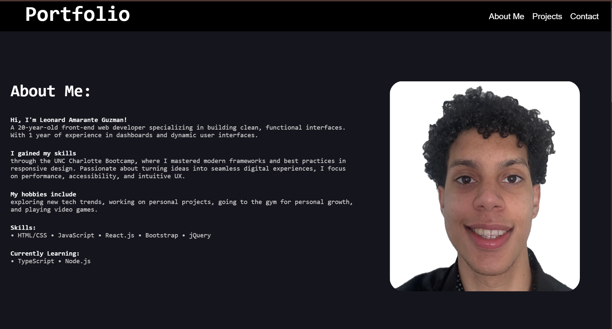

# My Personal Portfolio

## Welcome to my personal portfolio! This project showcases my skills, projects, and experience as a developer. Built with modern web technologies, it serves as a central hub for my professional work and personal projects.

## 🚀 Live Demo

### Visit My Portfolio URL(https://leonard-amarante-portfolio.netlify.app/)

## 📌 Features

* Responsive Design – Optimized for all devices (desktop, tablet, mobile)

* Interactive UI – Engaging animations and smooth transitions

* Projects Showcase – Highlighting my best work with descriptions and links

* Contact Form – Visitors can reach out directly via email

* Modern Tech Stack – Built with the latest web technologies

## 🛠 Tech Stack

* Frontend: React, Vite, Bootstrap

* Deployment: Netlify / GitHub Pages

## 📂 Project Structure

/my-personal-portfolio
│-- /public
│-- /src
│   │-- /components
│   │-- /pages
│   │-- /assets
│-- index.html
│-- package.json
│-- README.md
│-- vite.config.js

## 📸 Screenshot:

## 📜 Installation & Setup

### To run this project locally:

* git clone https://github.com/leonardAmarante/My-Personal-Portfolio.git
* cd My-Personal-Portfolio
* npm install
* npm run dev

## 📬 Contact

### Feel free to reach out!

* Email: LeonardAmarante32@gmail.com

* GitHub: @leonardAmarante

* LinkedIn: https://www.linkedin.com/in/leonard-amarante-46a06b359?utm_source=share&utm_campaign=share_via&utm_content=profile&utm_medium=ios_app

✨ Built with passion and creativity!